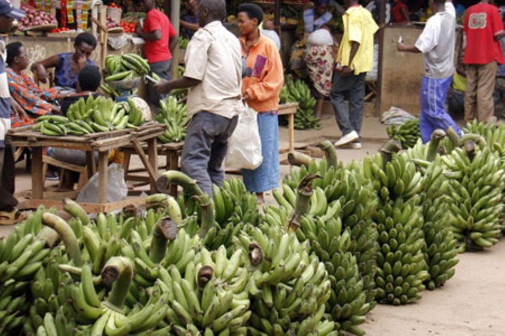
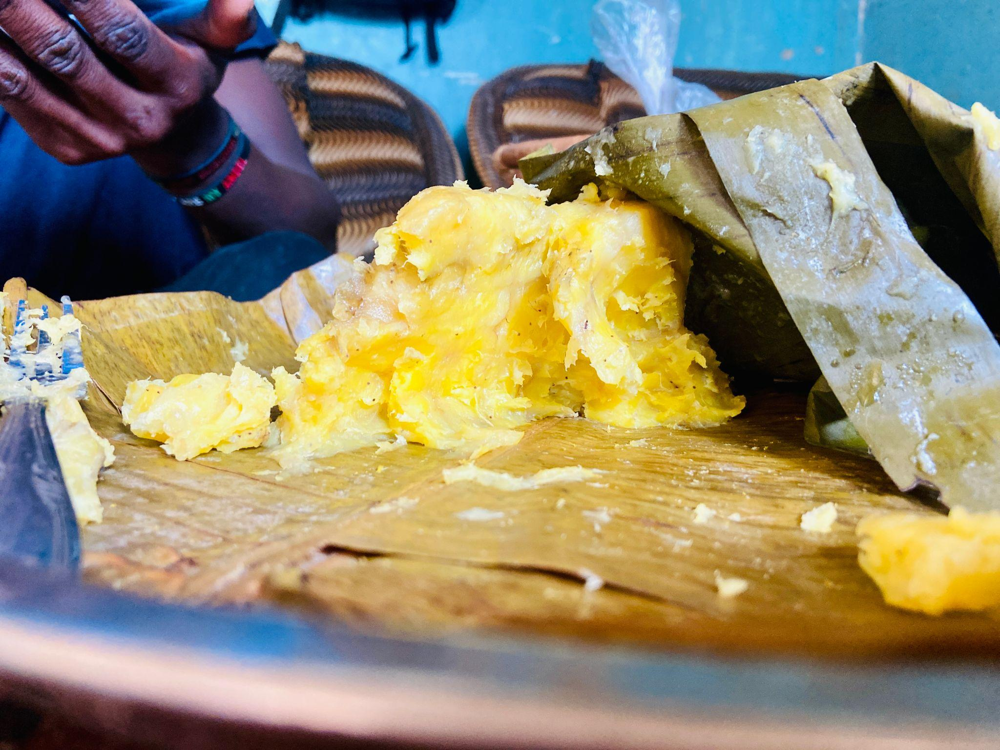

## Matooke: The Taste of Uganda

When people talk about Ugandan food, one dish is almost impossible to overlook: matooke. More than an everyday meal, matooke represents Uganda’s culture, hospitality, and agricultural heritage.

Matooke refers to green cooking bananas that are peeled, wrapped in banana leaves, and steamed until soft. The cooked bananas are then mashed while still inside the leaves, producing a smooth, warm, golden meal. Matooke has a mild taste, making it an excellent accompaniment to flavorful sauces.

It is commonly served with beef, chicken, beans, groundnut sauce, fish, or vegetables. In many Ugandan homes, especially in the central and western regions, a meal may feel incomplete without matooke. It is prepared for ordinary family meals as well as weddings, celebrations, and visits from important guests.

Preparing matooke traditionally requires patience and skill. The cook carefully peels the bananas, wraps them in clean banana leaves, and places them in a saucepan lined with banana stalks or leaves. Water is added beneath the wrapped bundle, allowing the matooke to cook slowly through steam. This method gives the food its distinctive aroma and texture.

Matooke also supports the livelihoods of many Ugandan farmers, traders, transporters, and food vendors. Large bunches of green bananas can be seen in gardens, roadside markets, and on trucks travelling from farming areas to towns and cities.

For Ugandans living abroad, matooke can bring back memories of home, family gatherings, and shared meals. It is not simply food placed on a plate; it is a connection to identity and tradition.

Anyone visiting Uganda should try matooke served with a rich local sauce. Its preparation, flavor, and cultural importance offer a memorable introduction to the Pearl of Africa. Matooke tells a simple but powerful story: Uganda’s history and hospitality can be experienced through its food.
